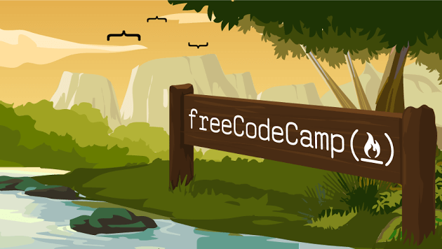

## [freeCodeCamp](https://www.freecodecamp.org/)

#### freeCodeCamp Legacy Challenges
1. [User Interface](01-front-end-cert/) - [README.md](01-front-end-cert/README.md)
1. [Data Visualization](02-data-vis-cert/) - [README.md](02-data-vis-cert/README.md)
1. [Back End](03-back-end-cert/) - [README.md](03-back-end-cert/README.md)

#### freeCodeCamp New Challenges
 1. [Responsive-Web-Design](11-Responsive-Web-Design)
 1. [Algorithms-and-Data-Structures](12-Algorithms-and-Data-Structures)
 1. [Front-End-Libraries](13-Front-End-Libraries)
 1. [Data-Visualization](14-Data-Visualization)
 1. [APIs-and-Microservices](15-APIs-and-Microservices)
 1. [Information-Security-and-Quality-Assurance](16-Information-Security-and-Quality-Assurance)

#### Coding Interview Prep
 1. [Algorithms](21-Algorithms/)
 1. [Data Structures](22-Data-Structures/)
 1. [Take Home Projects](23-Take-Home-Projects/)
 1. [Rosetta Code](24-rosettacode.org) - [https://rosettacode.org/](https://rosettacode.org/)
 1. [Project Euler](25-projecteuler.net) - [https://projecteuler.net/](https://projecteuler.net/)

